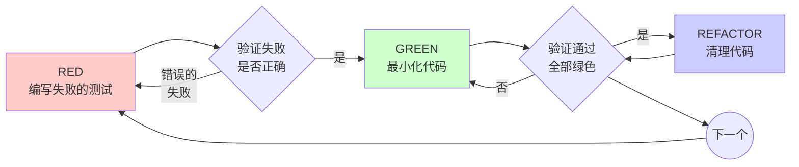

# 测试驱动开发(TDD)

## 概述

先写测试。观察它失败。编写最少的代码使其通过。

**核心原则：** 如果你没有看到测试失败，你就不知道它是否测试了正确的东西。

**先写代码再补测试 = 不是TDD。遵循步骤才能获得TDD的价值：**
1. 后写的测试会立即通过 → 无法验证测试本身是否正确
2. 根据实现写测试 → 测试的是"代码做了什么"，而非"代码应该做什么"
3. 依赖记忆补测试 → 会遗漏未曾考虑的边缘情况
4. 跳过红绿循环 → 失去测试驱动设计的反馈

## 何时使用

**总是使用：**
- 新功能
- Bug修复
- 重构
- 行为变更

**有限例外（需获得明确批准）：**
- 一次性原型（探索后即删除）
- 代码生成工具的输出
- 纯配置文件（JSON/YAML等）

**警告：** 任何"这次跳过TDD"的想法都是自我合理化。必须先获得批准，否则遵循TDD。

## 铁律

```
没有先编写失败的测试，就不许编写生产代码
```

**违反顺序的代码 → 立即删除 → 从测试开始重写。**

**执行规则（无例外）：**
1. 禁止保留"作为参考" → 你会忍不住调整它
2. 禁止"先写测试再调整代码" → 这就是测试后写
3. 禁止查看已删除的代码 → 会影响测试设计
4. 删除 = 永久删除 → 不是注释掉

**唯一正确的做法：** 先写测试，看它失败，再实现代码。

## Red-Green-Refactor循环



### RED - 编写失败的测试

编写一个最小的测试来展示应该发生什么。

<Good>
```typescript
test('retries failed operations 3 times', async () => {
  let attempts = 0;
  const operation = () => {
    attempts++;
    if (attempts < 3) throw new Error('fail');
    return 'success';
  };

  const result = await retryOperation(operation);

  expect(result).toBe('success');
  expect(attempts).toBe(3);
});
```
清晰的名称，测试真实行为，单一职责
</Good>

<Bad>
```typescript
test('retry works', async () => {
  const mock = jest.fn()
    .mockRejectedValueOnce(new Error())
    .mockRejectedValueOnce(new Error())
    .mockResolvedValueOnce('success');
  await retryOperation(mock);
  expect(mock).toHaveBeenCalledTimes(3);
});
```
模糊的名称，测试的是mock而不是代码
</Bad>

**要求：**
- 单一行为
- 清晰的名称
- 真实代码（除非不可避免，否则不使用mock）

### 验证RED - 观察它失败

**强制要求。绝不跳过。**

```bash
npm test path/to/test.test.ts
```

确认：
- 测试失败（不是错误）
- 失败消息符合预期
- 因为功能缺失而失败（不是拼写错误）

**测试通过？** 你在测试已存在的行为。修复测试。

**测试报错？** 修复错误，重新运行直到它正确失败。

### GREEN - 最小化代码

编写最简单的代码来通过测试。

<Good>
```typescript
async function retryOperation<T>(fn: () => Promise<T>): Promise<T> {
  for (let i = 0; i < 3; i++) {
    try {
      return await fn();
    } catch (e) {
      if (i === 2) throw e;
    }
  }
  throw new Error('unreachable');
}
```
刚好够用以通过测试
</Good>

<Bad>
```typescript
async function retryOperation<T>(
  fn: () => Promise<T>,
  options?: {
    maxRetries?: number;
    backoff?: 'linear' | 'exponential';
    onRetry?: (attempt: number) => void;
  }
): Promise<T> {
  // YAGNI - 你不需要它
}
```
过度设计
</Bad>

不要添加功能、重构其他代码或超出测试范围"改进"代码。

### 验证GREEN - 观察它通过

**强制要求。**

```bash
npm test path/to/test.test.ts
```

确认：
- 测试通过
- 其他测试仍然通过
- 输出干净（没有错误、警告）

**测试失败？** 修复代码，不是测试。

**其他测试失败？** 立即修复。

### REFACTOR - 清理代码

仅在绿色状态后：
- 消除重复
- 改进命名
- 提取辅助函数

保持测试绿色。不要添加行为。

### 重复

为下一个功能编写下一个失败的测试。

## 好的测试

| 质量 | 好 | 坏 |
|------|----|----|
| **最小化** | 一件事。名称中有"和"？拆分它。 | `test('validates email and domain and whitespace')` |
| **清晰** | 名称描述行为 | `test('test1')` |
| **展示意图** | 演示期望的API | 隐藏代码应该做什么 |

## 为什么顺序很重要

**"我会在之后编写测试来验证它工作"**

在代码之后编写的测试会立即通过。立即通过什么都证明不了：
- 可能测试了错误的东西
- 可能测试实现而不是行为
- 可能遗漏了你忘记的边缘情况
- 你从未看到它捕获bug

测试优先强制你看到测试失败，证明它确实测试了某些东西。

**"我已经手动测试了所有边缘情况"**

手动测试是临时的。你认为你测试了所有东西，但：
- 没有你测试了什么的记录
- 代码改变时无法重新运行
- 在压力下容易忘记情况
- "我试了一下它能工作" ≠ 全面的测试

自动化测试是系统化的。它们每次都以相同的方式运行。

**"删除X小时的工作是浪费"**

沉没成本谬论。时间已经过去了。你现在的选择：
- 删除并用TDD重写（再花X小时，高信心）
- 保留它并在之后添加测试（30分钟，低信心，可能有bug）

"浪费"是保留你无法信任的代码。没有真实测试的工作代码是技术债务。

**"TDD是教条主义，务实意味着适应"**

TDD就是务实的：
- 在提交前发现bug（比提交后调试更快）
- 防止回归（测试立即捕获破坏）
- 记录行为（测试展示如何使用代码）
- 支持重构（自由改变，测试捕获破坏）

"务实"的捷径 = 在生产环境中调试 = 更慢。

**"测试事后能达到同样的目标 - 这是精神而非仪式"**

不对。测试事后回答"这做了什么？"测试优先回答"这应该做什么？"

测试事后被你的实现所偏向。你测试你构建的东西，而不是需要的东西。你验证记住的边缘情况，而不是发现的边缘情况。

测试优先在实现前强制发现边缘情况。测试事后验证你记住了所有东西（你没有）。

30分钟的测试事后 ≠ TDD。你得到了覆盖率，失去了测试工作的证明。

## 常见的自我合理化

| 借口 | 现实 |
|------|------|
| "太简单了不需要测试" | 简单的代码也会坏。测试只需30秒。 |
| "我会事后测试" | 立即通过的测试什么都证明不了。 |
| "测试事后能达到同样的目标" | 测试事后 = "这做了什么？"测试优先 = "这应该做什么？" |
| "已经手动测试过了" | 临时 ≠ 系统化。没有记录，无法重新运行。 |
| "删除X小时是浪费" | 沉没成本谬论。保留未验证的代码是技术债务。 |
| "保留作为参考，先写测试" | 你会调整它。那就是测试事后。删除就是删除。 |
| "需要先探索" | 可以。扔掉探索，用TDD开始。 |
| "测试难 = 设计不清晰" | 听从测试。难以测试 = 难以使用。 |
| "TDD会拖慢我" | TDD比调试快。务实 = 测试优先。 |
| "手动测试更快" | 手动不能证明边缘情况。每次改变都要重新测试。 |
| "现有代码没有测试" | 你在改进它。为现有代码添加测试。 |

## 危险信号 - 停止并重新开始

- 代码在测试之前
- 实现后才测试
- 测试立即通过
- 无法解释为什么测试失败
- 测试"稍后"添加
- 自我合理化"就这一次"
- "我已经手动测试过了"
- "测试事后能达到同样的目的"
- "这是关于精神而不是仪式"
- "保留作为参考"或"调整现有代码"
- "已经花了X小时，删除是浪费"
- "TDD是教条主义，我在务实"
- "这是不同的因为..."

**所有这些都意味着：删除代码。用TDD重新开始。**

## 示例：Bug修复

**Bug：** 接受空邮箱

**RED**
```typescript
test('rejects empty email', async () => {
  const result = await submitForm({ email: '' });
  expect(result.error).toBe('Email required');
});
```

**验证RED**
```bash
$ npm test
FAIL: expected 'Email required', got undefined
```

**GREEN**
```typescript
function submitForm(data: FormData) {
  if (!data.email?.trim()) {
    return { error: 'Email required' };
  }
  // ...
}
```

**验证GREEN**
```bash
$ npm test
PASS
```

**REFACTOR**
如果需要，为多个字段提取验证。

## 验证清单

在标记工作完成之前：

- [ ] 每个新函数/方法都有测试
- [ ] 在实现前观察了每个测试失败
- [ ] 每个测试因预期原因失败（功能缺失，不是拼写错误）
- [ ] 编写了最小化代码通过每个测试
- [ ] 所有测试通过
- [ ] 输出干净（没有错误、警告）
- [ ] 测试使用真实代码（仅在不可避免时使用mock）
- [ ] 覆盖了边缘情况和错误

无法勾选所有框？你跳过了TDD。重新开始。

## 遇到困难时

| 问题 | 解决方案 |
|------|---------|
| 不知道如何测试 | 编写期望的API。先编写断言。询问你的人类伙伴。 |
| 测试太复杂 | 设计太复杂。简化接口。 |
| 必须mock所有东西 | 代码耦合度太高。使用依赖注入。 |
| 测试设置巨大 | 提取辅助函数。仍然复杂？简化设计。 |

## 调试集成

发现bug？编写重现它的失败测试。遵循TDD循环。测试证明修复并防止回归。

绝不要在没有测试的情况下修复bug。

## 测试反模式

在添加mock或测试工具时，阅读@testing-anti-patterns.md以避免常见陷阱：
- 测试mock行为而不是真实行为
- 在生产类中添加仅用于测试的方法
- 在不理解依赖的情况下使用mock

## 最终规则

```
生产代码 → 测试存在且先失败
否则 → 不是TDD
```

没有你的人类伙伴的许可，没有例外。
